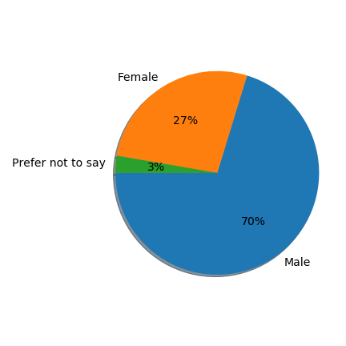
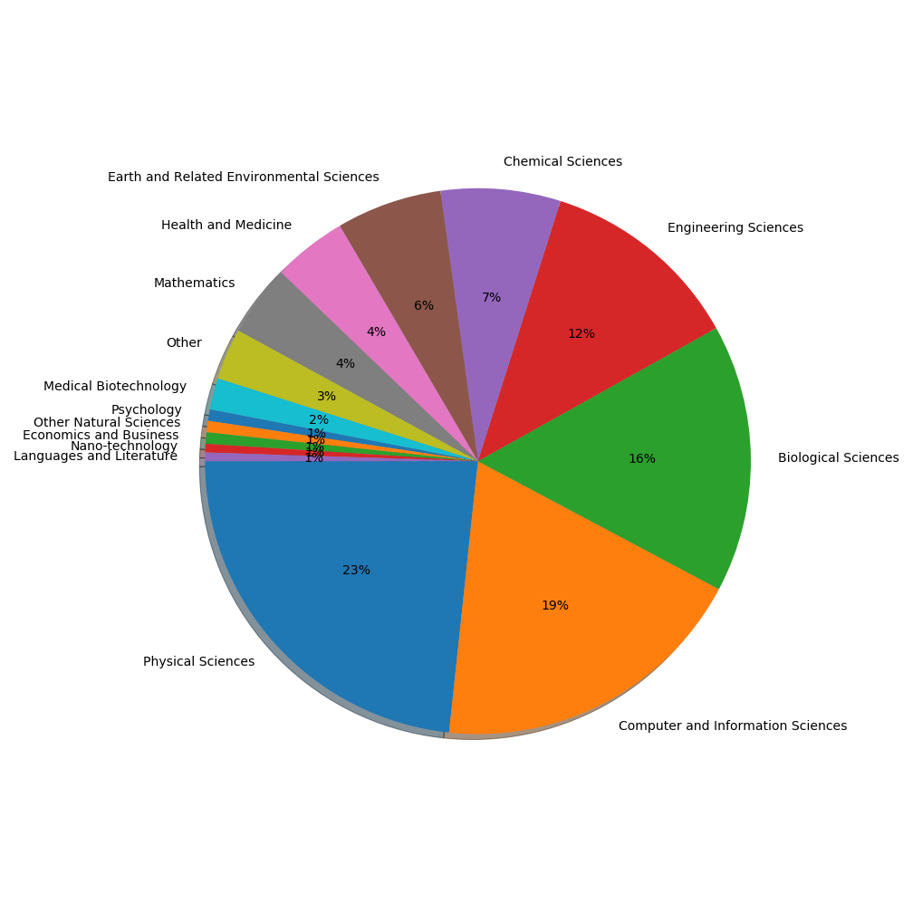
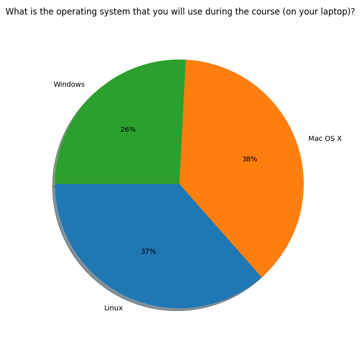
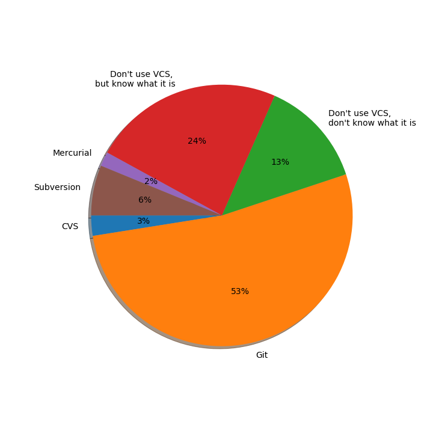
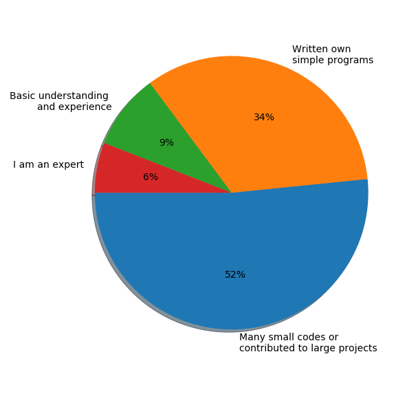
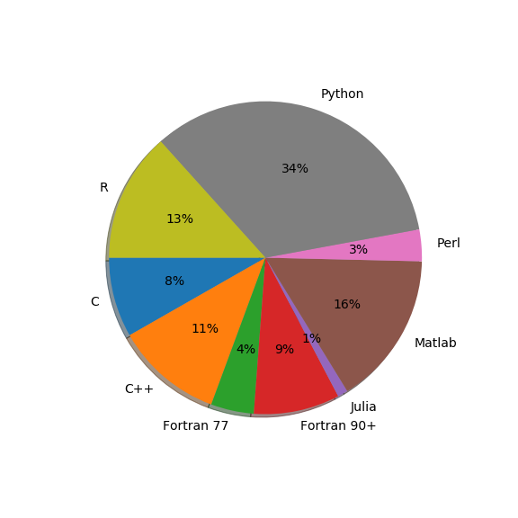
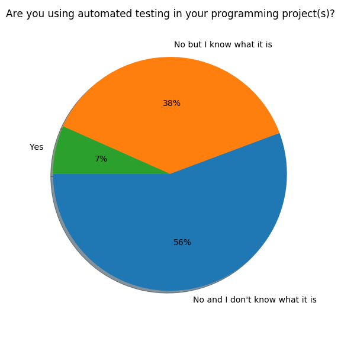
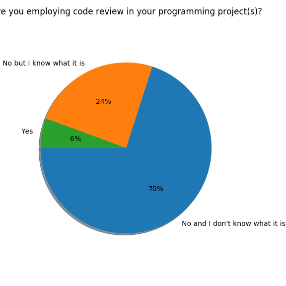

# CodeRefinery pre-workshop survey

Participants of CodeRefinery workshops are asked to fill a pre-workshop 
survey before attending the workshop. In this survey we collect information 
on previous experience with various tools and programming practices.

The survey includes the questions [listed here](questions.md).

## License and attribution

This work is licensed under CC 4.0 BY, see the [LICENSE](LICENSE) file.

When using the data from the CodeRefinery post-workshop survey, please state following attribution:
"Post-workshop survey" by [CodeRefinery](https://coderefinery.org), licensed under CC BY 4.0.

## Processing steps
[A script](preprocess-personal.py) 
is first used to remove personal information from the registration data.
Then, a [Jupyter Notebook](pre-workshop-analysis.ipynb) is 
used to analyze the data. 

## Survey results
The main results are reported in the figures below.

#### Gender

    

#### Scientific discipline

#### Operating system

    

#### Version control

    

#### Programming experience
    

#### Programming languages
    

#### Documentation
    

#### Automated testing
    

#### Code review
    

