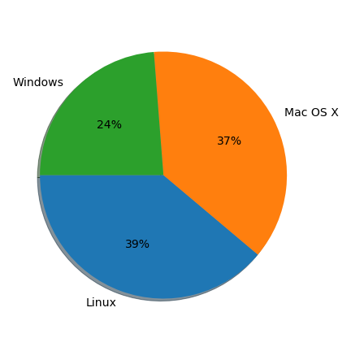

# CodeRefinery pre-workshop survey

Participants of CodeRefinery workshops are asked to fill a pre-workshop 
survey before attending the workshop. In this survey we collect information 
on previous experience with various tools and programming practices.

The survey includes among others the following questions:

- What is your gender? (used for reporting purposes)
- What operating system do you use?
- What is your programming experience? 
- Do you use version control?
- What is your preferred programming language?
- How do you document your code?

[A script](preprocess-personal.py) 
is first used to remove personal information from the registration data.
Then, a [Jupyter Notebook](pre-workshop-analysis.ipynb) is 
used to analyze the data. 

## Survey results
The main results are reported in the figures below.

#### Gender

    

#### Operating system

    

#### Version control

    

#### Programming experience
    

#### Programming languages
    

#### Documentation
    

